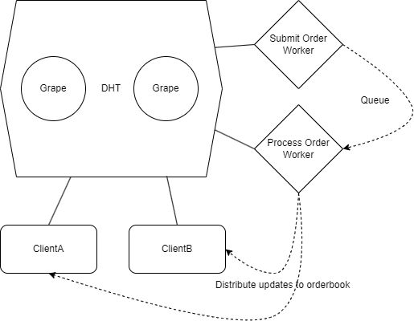

# p2p_distributed_order

## Challenge
Your task is to create a simplified distributed exchange

* Each client will have its own instance of the orderbook.
* Clients submit orders to their own instance of orderbook. The order is distributed to other instances, too.
* If a client's order matches with another order, any remainer is added to the orderbook, too.

# Proposed Solution

 - Submit order worker operates on the `submit_order` event by storing the payload in a queue, the queue is stored and processed in FIFO and sent to a process order worker.
 - Process order worker operates on the `process_order` event and applies the business logic for new orders being submitted to the orderbook, when an order is matched or added to the orderbook, then the orderbook is stored in the DHT using `link.put`, and then the update is broadcast to all instances of the orderbook in the Grenache network by publishing to the `orderbook_updated` event using `PeerRPCClient.map` with the `link.put` DHT hash as the payload
 - Clients can submit orders to their own instance of orderbook, and the order is distributed to other instances, too by sending a request to the `submit_order` worker with the order payload
 - Clients can subscribe to the `orderbook_updated` event and get the updated orderbook from DHT using `link.get` with the supplied DHT `hash` value

# Code

Find both `client` and `workers` under `/bin`.

 - Run `npm install` in the downlaoded folder 
 - start two grapes  `grape --dp 20001 --aph 30001 --bn '127.0.0.1:20002'` &&  `grape --dp 20002 --aph 40001 --bn '127.0.0.1:20001'`
 - Run submit order worker with `node bin/submitOrderWorker.js`
 - Run process order worker with `node bin/processOrderWorker.js`
 - Run x number of clients with `node bin/client.js`

Find reusable code under `/lib`.

# With more time

 - Implement order matching logic that checks against existing orders in the orderbook, by checking buy sell price and remainder
 - Error handling at each level to revert whilst maintaining a consistent state
 - Input validation on communication between microservices
 - Unit and integration tests against the proposed solution